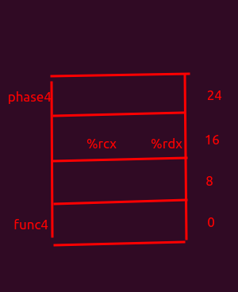

# bomb_lab
trying to defuse phase 1 - 6 by analyzing the x86-64 assembly code

## Phase 1 characteristics:
 - comparing strings 
 
 
## Phase 2 characteristics:
 - loop
 - pointer arithmetic

## Phase 3 characteristics:
 - string input function sscanf and its parameters (1st = string, 2nd = string format, starting from 3rd = format specifier, pass in pointer)
 - jump table (switch statement)

## Phase 4 characteristics:
 - string input function sscanf and its parameters (1st = string, 2nd = string format, starting from 3rd = format specifier, pass in pointer)
 - recursion

## Phase 5 characteristics:
  - Canary to defect potential buffer overflow
  - Array and pointer arithmetic
  - Mapping index after masking the lower 4 bytes
    

## Phase 6 characteristics:
  - linked-list, reverse linked-list
  - left and right pointer to swap number
    

